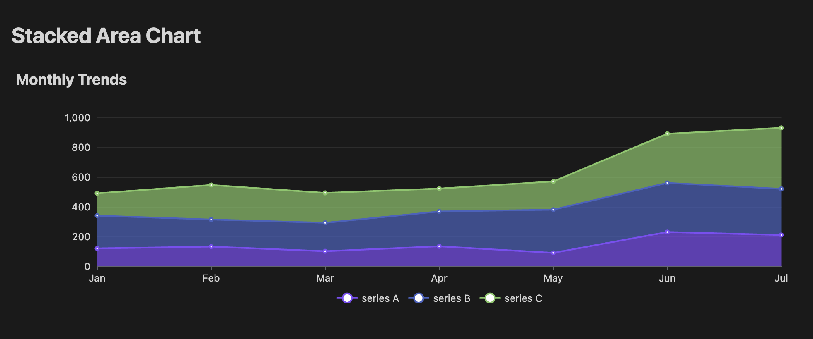
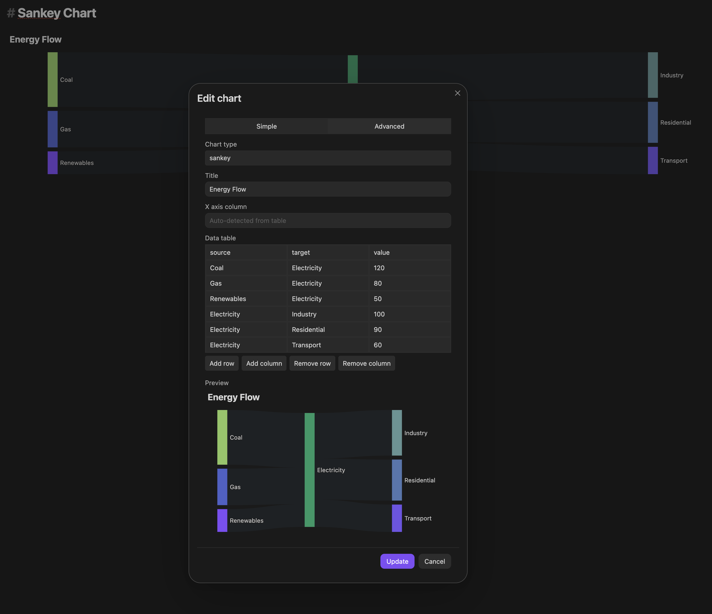

<p align="center">  </p>

# Fancy Charts

Charts that live where your notes do.



## Why

I really missed a modern chart plugin in Obsidian that would allow me to have self-contained blocks so I can use Obsidian to visualize data — and at the same time fit well with my AI flow. Fancy Charts not only produces clean visualizations, it also provides a clean format for data. Inside each block, the data lives as a plain Markdown table: easy to read and edit even without the plugin installed.

## Features

- **Charts embedded directly in notes** — render inline alongside your content, no separate view required
- **Eight chart types** — bar, line, pie, scatter, area, funnel, heatmap, sankey
- **Simple mode** — a short YAML config and a plain Markdown table is all you need; the plugin builds the chart automatically
- **Advanced mode** — pass a raw ECharts option object for full control over every chart property
- **Chart builder modal** — insert or edit charts through a form with a live preview; no hand-editing the block unless you want to
- **Human-readable format** — the data is a standard Markdown table; legible in any text editor, even without the plugin installed
- **Dark and light mode** — follows Obsidian's active theme automatically

## Installation

**From within Obsidian:**

1. Go to Settings → Community plugins → Browse
2. Search for **Fancy Charts**
3. Click Install, then Enable

## Usage

### Insert a chart

- Run **Fancy Charts: Insert chart** from the command palette, or
- Click the Fancy Charts ribbon icon

The chart builder modal opens. Choose a chart type, fill in the data table, set an optional title and axis, then click **Insert**. A `fancy-charts` block is written into your note and rendered immediately.

### Edit a chart

Click the **edit** button that appears on a rendered chart to reopen the modal pre-filled with the existing data. Make your changes, then click **Update**.



### Chart types

| Type | Description |
|------|-------------|
| `bar` | Vertical bar chart; one bar series per Y-axis column |
| `line` | Line chart; one line per Y-axis column |
| `pie` | Pie chart; one column for slice labels, one for values |
| `scatter` | Scatter plot; X column provides X values, first Y column provides Y values |
| `area` | Stacked area chart; one filled series per Y-axis column |
| `funnel` | Funnel chart; stage names and values |
| `heatmap` | Heatmap; X category, Y category, numeric value — colour scale auto-computed |
| `sankey` | Sankey flow diagram; source node, target node, flow value — nodes derived automatically |

### The data format

Charts are stored as a fenced `fancy-charts` code block in two modes:

**Simple mode** — a YAML config followed by a Markdown table:

````markdown
```fancy-charts
---
type: bar
title: Quarterly Revenue
xAxis: quarter
yAxis:
  - revenue
  - costs
---
| quarter | revenue | costs |
| --- | --- | --- |
| Q1 | 120 | 80 |
| Q2 | 200 | 110 |
| Q3 | 150 | 90 |
| Q4 | 180 | 100 |
```
````

**Advanced mode** — a raw ECharts option object for full control:

````markdown
```fancy-charts
echarts:
  xAxis:
    type: category
    data: [Q1, Q2, Q3, Q4]
  yAxis:
    type: value
  series:
    - type: bar
      data: [120, 200, 150, 180]
      name: Revenue
```
````

The full schema is documented in [docs/schema.md](docs/schema.md).

Because the data is a standard Markdown table, a chart block is still readable — as a table, without the interactive chart — in any Markdown viewer, even without the plugin.

## Feature Requests and Issues

If there's a gap you'd like prioritized, [open an issue](https://github.com/robertoallende/fancy-charts/issues) — this roadmap takes real usage and feedback into account.

## License

[MIT](LICENSE) — Copyright (c) 2026 Astuten.io Ltd

---

[](https://github.com/robertoallende/fancy-charts/actions/workflows/ci.yml)
[](https://codecov.io/gh/robertoallende/fancy-charts)
[](LICENSE)
